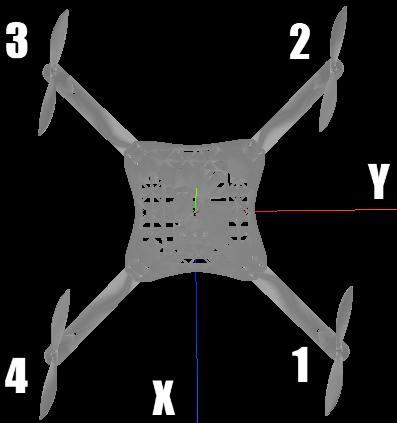

[toc]

# 四旋翼十字无人机

## 基本原理

### 模型图

图中四个规格相同的螺旋桨，其中1，2为逆时针旋转，3，4为顺时针旋转。这样的目的是为了消除反扭矩。后面无人机绕Z轴旋转正是利用了反扭矩。

### 力学分析

螺旋桨的转动，会产生向上的浮力和垂直于螺旋桨所在的连接杆的扭力，二者均正比于角速度平方。设四个螺旋桨的浮力与扭力分别为$F_1,\ F_2,\ F_3,\ F_4,\ T_1,\ T_2,\ T_3,\ T_4$，无人机重力为$G$。我们有如下的动力学模型
$$
T=C_T\omega^2,\ \ F=C_F\omega^2.
$$
下面我们分析无人机的状态。首先我们假设四个螺旋桨转速相同，则有$F=F_1+F_2+F_3+F_4=G$，从而无人机处于**悬浮**状态。下面改变某些螺旋桨的转速。

1. 四者转速增加(减小)且保持相同，则无人机**上升(下降)**。
2. 1号转速增加(减小)，2号转速减小(增加)，同时要求$T_{1+2}=T_{3+4}$(自然也有$F_{1+2}=F_{3+4}$)，则无人机**绕Y轴**旋转。
3. 3号转速增加(减小)，4号转速减小(增加)，同时要求$T_{1+2}=T_{3+4}$(自然也有$F_{1+2}=F_{3+4}$)，则无人机**绕X轴**旋转。
4. 1，2号增加(减小)且保持相同，则无人机**绕Z轴**旋转，同时上升(下降)。

对于第二种情况，如果不要求对轴扭力和(浮力和)相同，则无人机除了绕Y轴，还可能会绕Z轴旋转以及上升(下降)。第三种情况类似。

### 场景

## 仿真

Todo.

## 参考资料

1. [QuadrotorFly-四旋翼无人机动力学仿真环境介绍](https://blog.csdn.net/linxiaobo110/article/details/89890970#四旋翼基本动力学模型).
2. [3D模型资源](http://www.3dwhere.com/).

